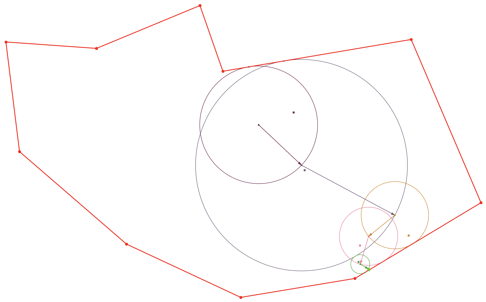

```diff
- WORK IN PROGRESS
```

# PyWOS


Monte Carlo method based on a walk-on-spheres implementation for solving a 2D Poisson PDE written in Python.

Based on the excellent [video](https://youtu.be/bZbuKOxH71o) by Keenan Crane from Carnegie Mellon University and a code snippet he provided [here](https://www.cs.cmu.edu/~kmcrane/Projects/MonteCarloGeometryProcessing/WoSPoisson2D.cpp.html).

The version presented here utilizes recursion.

Associated literature and [video](https://youtu.be/dXROl0KGPXc) from the original author:
["Grid-Free Monte Carlo for PDEs with Spatially Varying Coefficients"](https://arxiv.org/abs/2201.13240) by Sawhney, Seyb, Jarosz, Crane.
